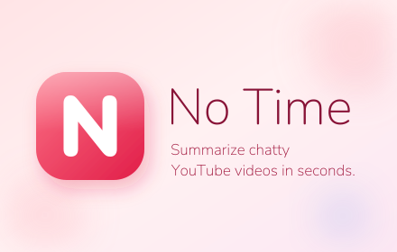

# No Time

> For videos that talk too much.

A Chrome extension that summarizes a YouTube video using its built-in transcript and an AI provider of your choice (Anthropic Claude or OpenAI). Bring your own API key.

## Why

A lot of YouTube videos take 40 minutes to make a 3-minute point. No Time pulls the transcript YouTube already generates, sends it to an LLM, and shows you the actual takeaway in seconds.

## Install (development build)

1. Clone or download this repo.
2. Open `chrome://extensions`, enable **Developer mode**.
3. Click **Load unpacked**, select this folder.
4. Click the extension icon → paste your Anthropic or OpenAI key → done.

## How it works

- A content script on YouTube watch pages extracts the transcript (clicking YouTube's "Show transcript" button, falling back to the caption track if needed).
- The transcript + video metadata are sent **directly from your browser** to the API of the provider you selected. Nothing routes through a third-party server.
- The result is rendered inline in the popup.

## Configuration

Open **Settings** from the popup to:

- Switch the default provider.
- Update API keys.
- Override the model (defaults: `claude-haiku-4-5`, `gpt-4o-mini`).

## Privacy

Keys are stored in `chrome.storage.local`. Transcripts are sent only to the provider you selected, using your key. See [PRIVACY.md](./PRIVACY.md) for details.

## Tech

Vanilla HTML/CSS/JS, Manifest V3 service worker, no build step, no dependencies. The clay-style UI uses Nunito + DM Sans from Google Fonts.

## License

MIT
